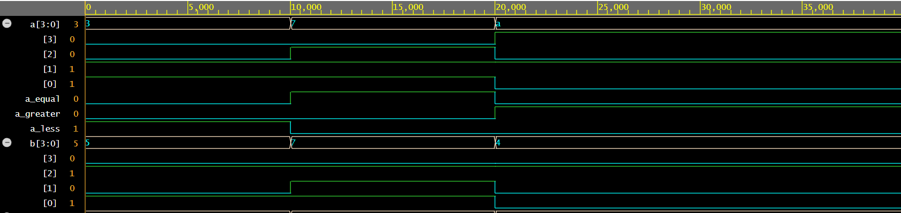

# 4-bit Comparator – Verilog

This module implements a 4-bit magnitude comparator.  
It compares two 4-bit numbers and indicates whether:

- A > B
- A = B
- A < B

## Files
- comparator_4bit.v
- comparator_4bit_tb.v

## Simulation Waveform

