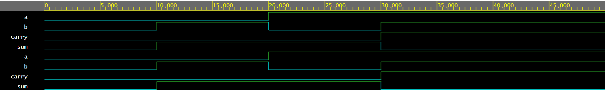

# Half Adder – Verilog

This module implements a Half Adder using synthesizable Verilog.  
It adds two 1-bit inputs and produces a **Sum** and **Carry**.

## Files
- half_adder.v
- half_adder_tb.v

## Simulation Waveform

