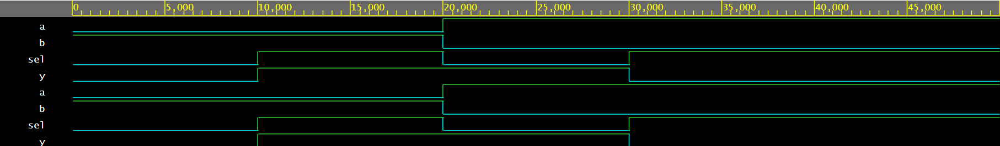

# 2x1 Multiplexer – Verilog

This module implements a 2x1 Multiplexer using synthesizable Verilog.  
Based on the select line, one of the two inputs is routed to the output.

## Files
- mux_2x1.v
- mux_2x1_tb.v

## Simulation Waveform

