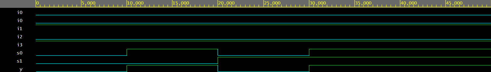

# 4x1 Multiplexer – Verilog

This module implements a 4x1 Multiplexer using synthesizable Verilog.  
Based on the two select lines, one of the four inputs is routed to the output.

## Files
- mux_4x1.v
- mux_4x1_tb.v

## Simulation Waveform

