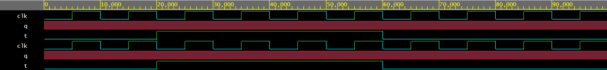

# T Flip-Flop – Verilog

This module implements a positive edge–triggered T Flip-Flop.  
When `T = 1`, the output toggles on every clock edge.  
When `T = 0`, the output holds its state.

## Files
- t_flipflop.v
- t_flipflop_tb.v

## Simulation Waveform

